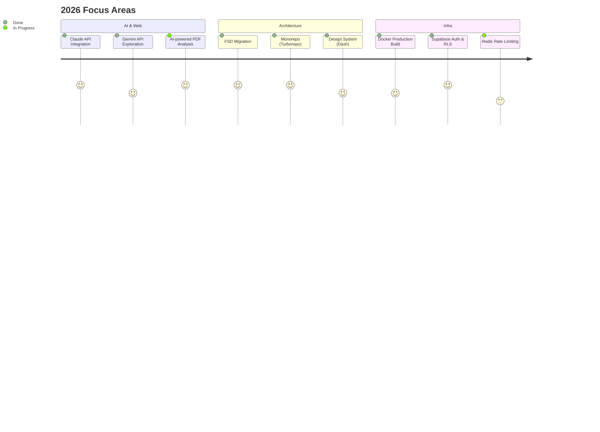

<div align="center">

[](https://github.com/sgd122)

# Gidong Seong

**Web Developer** &nbsp;&middot;&nbsp; Seoul, Korea

I build web products with clean architecture and great developer experience.<br/>
Previously at **[@travelmakers](https://github.com/travelmakers)**, building Next.js platforms and design systems.

<br/>

[`Blog`](https://blog.dnd.ac/) &nbsp;&middot;&nbsp; [`LinkedIn`](https://www.linkedin.com/in/sgd122/) &nbsp;&middot;&nbsp; [`Email`](mailto:sgd0947@gmail.com)

</div>

<br/>

## Currently Working On

- Building [**Contract Guardian**](https://github.com/sgd122/contract-guardian) — AI 계약서 분석 SaaS (Next.js 16 + Claude API + Supabase)
- Applying **Feature-Sliced Design** architecture to production monorepo
- Exploring AI integration patterns: Claude API, Gemini API in Next.js apps



<br/>

## Dev Approach

```
Type-safe everything     Zod validation + TypeScript strict mode, end-to-end type safety
FSD architecture         Layered imports: shared → entities → features → widgets → pages
Monorepo-first           Turborepo + pnpm workspaces, shared packages across apps
Production habits        Rate limiting, audit logging, PII filtering, CORS — built in from day one
```

<br/>

## Stack

```
Frontend        TypeScript  ·  React  ·  Next.js  ·  Tailwind CSS  ·  React Native
Backend         Node.js  ·  Supabase  ·  GraphQL  ·  MySQL
Infra           Docker  ·  GitHub Actions  ·  AWS  ·  Vercel  ·  Turborepo
```

<br/>

## Projects

<table>
<tr>
<td width="50%">

### [nextjs-boilerplate](https://github.com/travelmakers/travelmakers-nextjs-boilerplate)
Next.js production boilerplate with TypeScript, ESLint, and CI/CD pipeline.

`Next.js` `TypeScript`

</td>
<td width="50%">

### [dash](https://github.com/travelmakers/dash)
Design system & component library for travelmakers products.

`React` `TypeScript`

</td>
</tr>
<tr>
<td width="50%">

### [contract-guardian](https://github.com/sgd122/contract-guardian)
AI-powered contract analysis platform using Claude API for Korean freelancers.

`Next.js` `Claude API` `Supabase`

</td>
<td width="50%">

### [dndacademy.github.io](https://github.com/DNDACADEMY/dndacademy.github.io)
DND community tech blog — collaborative knowledge sharing platform.

`Jekyll` `SCSS`

</td>
</tr>
</table>

<br/>

<details>
<summary><b>WakaTime</b></summary>
<br/>

<!--START_SECTION:waka-->


**I'm an Early 🐤** 

```text
🌞 Morning                5215 commits        ██████░░░░░░░░░░░░░░░░░░░   24.15 % 
🌆 Daytime                11101 commits       █████████████░░░░░░░░░░░░   51.41 % 
🌃 Evening                5150 commits        ██████░░░░░░░░░░░░░░░░░░░   23.85 % 
🌙 Night                  128 commits         ░░░░░░░░░░░░░░░░░░░░░░░░░   00.59 % 
```
📅 **I'm Most Productive on Wednesday** 

```text
Monday                   3205 commits        ████░░░░░░░░░░░░░░░░░░░░░   14.84 % 
Tuesday                  4011 commits        █████░░░░░░░░░░░░░░░░░░░░   18.57 % 
Wednesday                5297 commits        ██████░░░░░░░░░░░░░░░░░░░   24.53 % 
Thursday                 3025 commits        ████░░░░░░░░░░░░░░░░░░░░░   14.01 % 
Friday                   2932 commits        ███░░░░░░░░░░░░░░░░░░░░░░   13.58 % 
Saturday                 1465 commits        ██░░░░░░░░░░░░░░░░░░░░░░░   06.78 % 
Sunday                   1659 commits        ██░░░░░░░░░░░░░░░░░░░░░░░   07.68 % 
```


📊 **This Week I Spent My Time On** 

```text
🕑︎ Time Zone: Asia/Seoul

💬 Programming Languages: 
Other                    5 hrs 22 mins       ████████████████░░░░░░░░░   64.11 % 
TypeScript               1 hr 2 mins         ███░░░░░░░░░░░░░░░░░░░░░░   12.45 % 
JSON                     54 mins             ███░░░░░░░░░░░░░░░░░░░░░░   10.94 % 
Bash                     48 mins             ██░░░░░░░░░░░░░░░░░░░░░░░   09.58 % 
YAML                     12 mins             █░░░░░░░░░░░░░░░░░░░░░░░░   02.57 % 

🔥 Editors: 
Cursor                   4 hrs 12 mins       █████████████░░░░░░░░░░░░   50.14 % 
Google Calendar          4 hrs               ████████████░░░░░░░░░░░░░   47.75 % 
VS Code                  10 mins             █░░░░░░░░░░░░░░░░░░░░░░░░   02.11 % 

💻 Operating System: 
Mac                      4 hrs 22 mins       █████████████░░░░░░░░░░░░   52.25 % 
Unknown OS               4 hrs               ████████████░░░░░░░░░░░░░   47.75 % 
```

**I Mostly Code in TypeScript** 

```text
TypeScript               27 repos            ██████████░░░░░░░░░░░░░░░   40.91 % 
JavaScript               21 repos            ████████░░░░░░░░░░░░░░░░░   31.82 % 
Python                   7 repos             ███░░░░░░░░░░░░░░░░░░░░░░   10.61 % 
Jupyter Notebook         2 repos             █░░░░░░░░░░░░░░░░░░░░░░░░   03.03 % 
MDX                      1 repo              ░░░░░░░░░░░░░░░░░░░░░░░░░   01.52 % 
```


 Last Updated on 21/02/2026 00:39:48 UTC
<!--END_SECTION:waka-->

</details>

<br/>

<div align="center">

[](https://github.com/sgd122)

</div>
