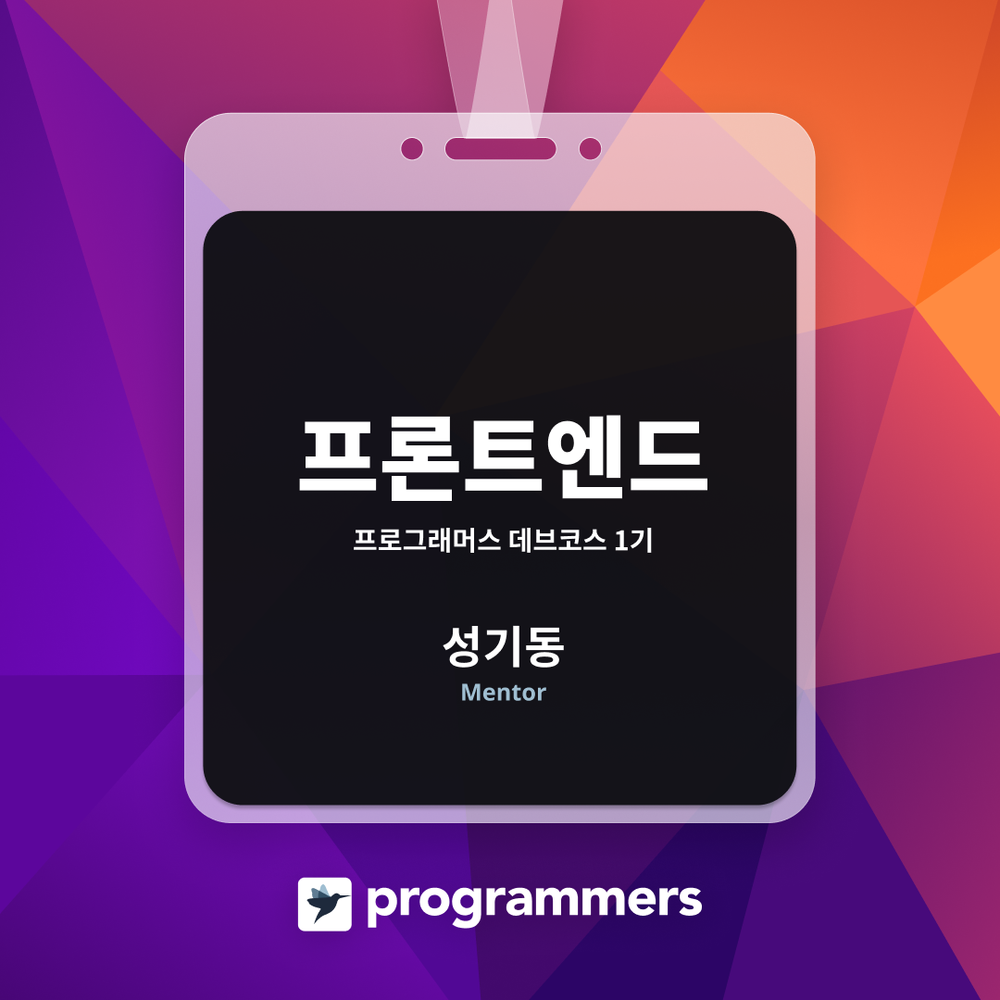

  
<div align=center>
  
[![GitHub Trophy]](https://github.com/ryo-ma/github-profile-trophy "GitHub Profile Trophy")
![GitHub Stats] 
<!--  [![GitHub Stats] ![Top Languages]](https://github.com/anuraghazra/github-readme-stats "GitHub Readme Stats") -->

</div>

<h3 align="center">Web Developer</h3>

- [Web Developer](https://sgd122.github.io/)
- [DND - Brings joy to the project, Brings opportunity to all](https://dnd.ac/).
- [GDG Busan](https://gdg.community.dev/gdg-busan/)
- [programmers - K-Digital Training: 빅데이터 플랫폼 프론트엔드 엔지니어링](https://programmers.co.kr/learn/courses/12175)
- [Tech Blog](https://blog.dnd.ac)


<h3 align="center">🛠 Language 🛠</h3>


<p align="center">
  
  
  
  
  
  
  <br/>
  
  
  
  
  
</p>


<details>
  <summary>🕙 WakaTime</summary>

<!--START_SECTION:waka-->


**I'm an Early 🐤** 

```text
🌞 Morning    249 commits    █████░░░░░░░░░░░░░░░░░░░░   21.01% 
🌆 Daytime    686 commits    ██████████████░░░░░░░░░░░   57.89% 
🌃 Evening    250 commits    █████░░░░░░░░░░░░░░░░░░░░   21.1% 
🌙 Night      0 commits      ░░░░░░░░░░░░░░░░░░░░░░░░░   0.0%

```
📅 **I'm Most Productive on Wednesday** 

```text
Monday       170 commits    ███░░░░░░░░░░░░░░░░░░░░░░   14.35% 
Tuesday      141 commits    ███░░░░░░░░░░░░░░░░░░░░░░   11.9% 
Wednesday    230 commits    ████░░░░░░░░░░░░░░░░░░░░░   19.41% 
Thursday     203 commits    ████░░░░░░░░░░░░░░░░░░░░░   17.13% 
Friday       228 commits    ████░░░░░░░░░░░░░░░░░░░░░   19.24% 
Saturday     113 commits    ██░░░░░░░░░░░░░░░░░░░░░░░   9.54% 
Sunday       100 commits    ██░░░░░░░░░░░░░░░░░░░░░░░   8.44%

```


📊 **This Week I Spent My Time On** 

```text
⌚︎ Time Zone: Asia/Seoul

💬 Programming Languages: 
JavaScript               4 hrs 47 mins       █████████████████████░░░░   84.65% 
Markdown                 46 mins             ███░░░░░░░░░░░░░░░░░░░░░░   13.71% 
HTML                     5 mins              ░░░░░░░░░░░░░░░░░░░░░░░░░   1.52% 
CSS                      0 secs              ░░░░░░░░░░░░░░░░░░░░░░░░░   0.06% 
Python                   0 secs              ░░░░░░░░░░░░░░░░░░░░░░░░░   0.06%

🔥 Editors: 
VS Code                  5 hrs 39 mins       █████████████████████████   100.0%

💻 Operating System: 
Mac                      5 hrs 29 mins       ████████████████████████░   96.91% 
Windows                  10 mins             ░░░░░░░░░░░░░░░░░░░░░░░░░   3.09%

```

**I Mostly Code in JavaScript** 

```text
JavaScript               17 repos            █████████████░░░░░░░░░░░░   54.84% 
Python                   5 repos             ████░░░░░░░░░░░░░░░░░░░░░   16.13% 
TypeScript               3 repos             ██░░░░░░░░░░░░░░░░░░░░░░░   9.68% 
PHP                      2 repos             █░░░░░░░░░░░░░░░░░░░░░░░░   6.45% 
SCSS                     1 repo              ░░░░░░░░░░░░░░░░░░░░░░░░░   3.23%

```


 Last Updated on 01/09/2021
<!--END_SECTION:waka-->
</details>

<div align=center>

[](http://sgd122.github.io/)
[](http://dndacademy.github.io/)
[](https://linkedin.com/company/dndacademy)
[](https://www.youtube.com/channel/UCLzVjG8j1m4X8TSpMF-x5yw)
[](https://www.facebook.com/DNDACADEMY)
[](https://www.instagram.com/seong_dev/)
[](mailto:sgd0947@gmail.com)

</div>

<div align=center>
  
  [](https://hits.seeyoufarm.com)
  
</div>


<!-- ===================== TAG ===================== -->
  
<!-- user status -->
[github stats]: https://github-readme-stats.vercel.app/api?username=sgd122&title_color=5f4b8b&text_color=f0eee9&icon_color=00abc0&bg_color=212121&hide_border=true&hide_title=true&theme=&show_icons=true&include_all_commits=true&count_private=true&line_height=24
[top languages]: https://github-readme-stats.vercel.app/api/top-langs?username=sgd122&title_color=5f4b8b&text_color=f0eee9&icon_color=00abc0&bg_color=212121&hide_border=true&hide_title=true&layout=compact&langs_count=8&hide=html,css,tex
[github trophy]: https://github-profile-trophy.vercel.app/?username=sgd122&theme=juicyfresh&column=7&row=1&no-frame=true

<!-- badge -->
