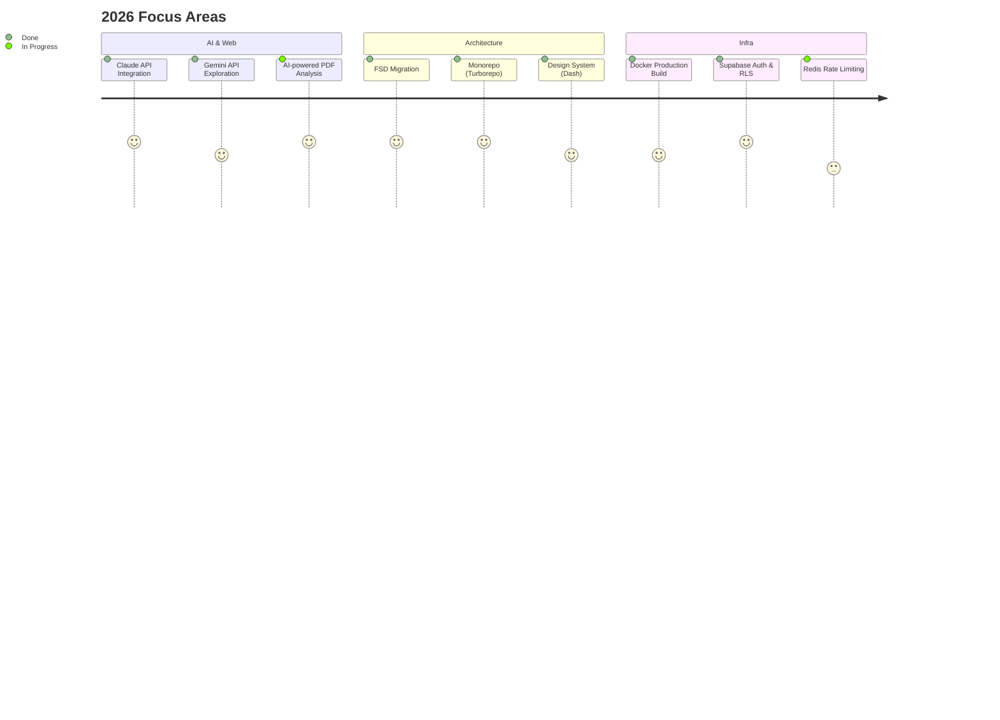

<div align="center">

[](https://github.com/sgd122)

# Gidong Seong

**Web Developer** &nbsp;&middot;&nbsp; Seoul, Korea

I build web products with clean architecture and great developer experience.<br/>
Previously at **[@travelmakers](https://github.com/travelmakers)**, building Next.js platforms and design systems.

<br/>

[`Portfolio`](http://sgd122.github.io/) &nbsp;&middot;&nbsp; [`Blog`](http://dndacademy.github.io/) &nbsp;&middot;&nbsp; [`LinkedIn`](https://linkedin.com/company/dndacademy) &nbsp;&middot;&nbsp; [`Email`](mailto:sgd0947@gmail.com)

</div>

<br/>

## Currently Working On

- Building [**Contract Guardian**](https://github.com/sgd122/contract-guardian) — AI 계약서 분석 SaaS (Next.js 16 + Claude API + Supabase)
- Applying **Feature-Sliced Design** architecture to production monorepo
- Exploring AI integration patterns: Claude API, Gemini API in Next.js apps



<br/>

## Dev Approach

```
Type-safe everything     Zod validation + TypeScript strict mode, end-to-end type safety
FSD architecture         Layered imports: shared → entities → features → widgets → pages
Monorepo-first           Turborepo + pnpm workspaces, shared packages across apps
Production habits        Rate limiting, audit logging, PII filtering, CORS — built in from day one
```

<br/>

## Stack

```
Frontend        TypeScript  ·  React  ·  Next.js  ·  Tailwind CSS  ·  React Native
Backend         Node.js  ·  Supabase  ·  GraphQL  ·  MySQL
Infra           Docker  ·  GitHub Actions  ·  AWS  ·  Vercel  ·  Turborepo
```

<br/>

## Projects

<table>
<tr>
<td width="50%">

### [nextjs-boilerplate](https://github.com/travelmakers/travelmakers-nextjs-boilerplate)
Next.js production boilerplate with TypeScript, ESLint, and CI/CD pipeline.

`Next.js` `TypeScript`

</td>
<td width="50%">

### [dash](https://github.com/travelmakers/dash)
Design system & component library for travelmakers products.

`React` `TypeScript`

</td>
</tr>
<tr>
<td width="50%">

### [contract-guardian](https://github.com/sgd122/contract-guardian)
AI-powered contract analysis platform using Claude API for Korean freelancers.

`Next.js` `Claude API` `Supabase`

</td>
<td width="50%">

### [dndacademy.github.io](https://github.com/DNDACADEMY/dndacademy.github.io)
DND community tech blog — collaborative knowledge sharing platform.

`Jekyll` `SCSS`

</td>
</tr>
</table>

<br/>

<details>
<summary><b>WakaTime</b></summary>
<br/>

<!--START_SECTION:waka-->


**I'm an Early 🐤**

```text
🌞 Morning                5135 commits        ██████░░░░░░░░░░░░░░░░░░░   24.25 %
🌆 Daytime                10923 commits       █████████████░░░░░░░░░░░░   51.58 %
🌃 Evening                4998 commits        ██████░░░░░░░░░░░░░░░░░░░   23.60 %
🌙 Night                  121 commits         ░░░░░░░░░░░░░░░░░░░░░░░░░   00.57 %
```
📅 **I'm Most Productive on Wednesday**

```text
Monday                   3140 commits        ████░░░░░░░░░░░░░░░░░░░░░   14.83 %
Tuesday                  3926 commits        █████░░░░░░░░░░░░░░░░░░░░   18.54 %
Wednesday                5228 commits        ██████░░░░░░░░░░░░░░░░░░░   24.69 %
Thursday                 2912 commits        ███░░░░░░░░░░░░░░░░░░░░░░   13.75 %
Friday                   2893 commits        ███░░░░░░░░░░░░░░░░░░░░░░   13.66 %
Saturday                 1453 commits        ██░░░░░░░░░░░░░░░░░░░░░░░   06.86 %
Sunday                   1625 commits        ██░░░░░░░░░░░░░░░░░░░░░░░   07.67 %
```


📊 **This Week I Spent My Time On**

```text
🕑︎ Time Zone: Asia/Seoul

💬 Programming Languages:
TypeScript               2 hrs 20 mins       ███████░░░░░░░░░░░░░░░░░░   27.33 %
Other                    2 hrs 11 mins       ██████░░░░░░░░░░░░░░░░░░░   25.74 %
Bash                     1 hr 47 mins        █████░░░░░░░░░░░░░░░░░░░░   20.96 %
JSON                     1 hr 20 mins        ████░░░░░░░░░░░░░░░░░░░░░   15.64 %
Markdown                 30 mins             ██░░░░░░░░░░░░░░░░░░░░░░░   06.04 %

🔥 Editors:
Cursor                   6 hrs 51 mins       ████████████████████░░░░░   80.37 %
Google Calendar          1 hr 30 mins        ████░░░░░░░░░░░░░░░░░░░░░   17.56 %
VS Code                  10 mins             █░░░░░░░░░░░░░░░░░░░░░░░░   02.07 %

💻 Operating System:
Mac                      7 hrs 2 mins        █████████████████████░░░░   82.44 %
Unknown OS               1 hr 30 mins        ████░░░░░░░░░░░░░░░░░░░░░   17.56 %
```

**I Mostly Code in TypeScript**

```text
TypeScript               26 repos            ██████████░░░░░░░░░░░░░░░   40.62 %
JavaScript               21 repos            ████████░░░░░░░░░░░░░░░░░   32.81 %
Python                   7 repos             ███░░░░░░░░░░░░░░░░░░░░░░   10.94 %
Jupyter Notebook         2 repos             █░░░░░░░░░░░░░░░░░░░░░░░░   03.12 %
MDX                      1 repo              ░░░░░░░░░░░░░░░░░░░░░░░░░   01.56 %
```


 Last Updated on 16/02/2026 00:41:42 UTC
<!--END_SECTION:waka-->

</details>

<br/>

<div align="center">

[](https://github.com/sgd122)

</div>
