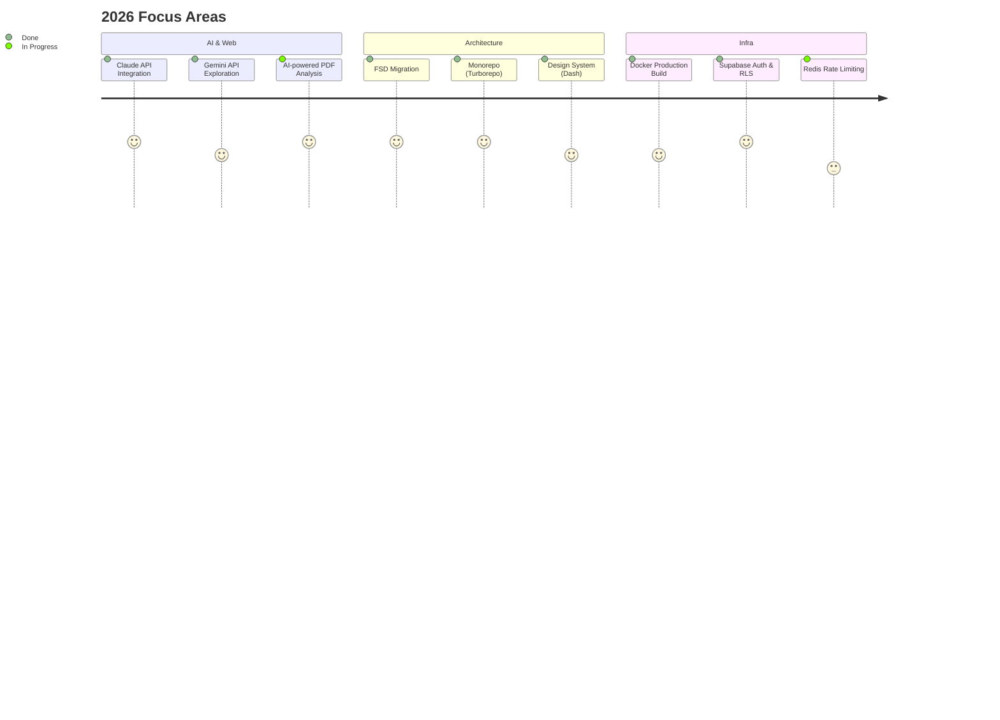

<div align="center">

[](https://github.com/sgd122)

# Gidong Seong

**Web Developer** &nbsp;&middot;&nbsp; Seoul, Korea

I build web products with clean architecture and great developer experience.<br/>
Previously at **[@travelmakers](https://github.com/travelmakers)**, building Next.js platforms and design systems.

<br/>

[`Blog`](https://blog.dnd.ac/) &nbsp;&middot;&nbsp; [`LinkedIn`](https://www.linkedin.com/in/sgd122/) &nbsp;&middot;&nbsp; [`Email`](mailto:sgd0947@gmail.com)

</div>

<br/>

## Currently Working On

- Building [**Contract Guardian**](https://github.com/sgd122/contract-guardian) — AI 계약서 분석 SaaS (Next.js 16 + Claude API + Supabase)
- Applying **Feature-Sliced Design** architecture to production monorepo
- Exploring AI integration patterns: Claude API, Gemini API in Next.js apps


```mermaid
journey
    title 2026 Focus Areas
    section AI & Web
      Claude API Integration: 5: Done
      Gemini API Exploration: 4: Done
      AI-powered PDF Analysis: 5: In Progress
    section Architecture
      FSD Migration: 5: Done
      Monorepo (Turborepo): 5: Done
      Design System (Dash): 4: Done
    section Infra
      Docker Production Build: 4: Done
      Supabase Auth & RLS: 5: Done
      Redis Rate Limiting: 3: In Progress
```

<br/>

## Dev Approach

```
Type-safe everything     Zod validation + TypeScript strict mode, end-to-end type safety
FSD architecture         Layered imports: shared → entities → features → widgets → pages
Monorepo-first           Turborepo + pnpm workspaces, shared packages across apps
Production habits        Rate limiting, audit logging, PII filtering, CORS — built in from day one
```

<br/>

## Stack

```
Frontend        TypeScript  ·  React  ·  Next.js  ·  Tailwind CSS  ·  React Native
Backend         Node.js  ·  Supabase  ·  GraphQL  ·  MySQL
Infra           Docker  ·  GitHub Actions  ·  AWS  ·  Vercel  ·  Turborepo
```

<br/>

<details>
<summary><b>WakaTime</b></summary>
<br/>

<!--START_SECTION:waka-->


**I'm an Early 🐤** 

```text
🌞 Morning                5144 commits        ██████░░░░░░░░░░░░░░░░░░░   24.85 % 
🌆 Daytime                10668 commits       █████████████░░░░░░░░░░░░   51.53 % 
🌃 Evening                4807 commits        ██████░░░░░░░░░░░░░░░░░░░   23.22 % 
🌙 Night                  85 commits          ░░░░░░░░░░░░░░░░░░░░░░░░░   00.41 % 
```
📅 **I'm Most Productive on Wednesday** 

```text
Monday                   3072 commits        ████░░░░░░░░░░░░░░░░░░░░░   14.84 % 
Tuesday                  3803 commits        █████░░░░░░░░░░░░░░░░░░░░   18.37 % 
Wednesday                5182 commits        ██████░░░░░░░░░░░░░░░░░░░   25.03 % 
Thursday                 2896 commits        ███░░░░░░░░░░░░░░░░░░░░░░   13.99 % 
Friday                   2781 commits        ███░░░░░░░░░░░░░░░░░░░░░░   13.43 % 
Saturday                 1432 commits        ██░░░░░░░░░░░░░░░░░░░░░░░   06.92 % 
Sunday                   1538 commits        ██░░░░░░░░░░░░░░░░░░░░░░░   07.43 % 
```


📊 **This Week I Spent My Time On** 

```text
🕑︎ Time Zone: Asia/Seoul

💬 Programming Languages: 
Other                    6 hrs               ████████████████████████░   95.39 % 
YAML                     17 mins             █░░░░░░░░░░░░░░░░░░░░░░░░   04.61 % 

🔥 Editors: 
Google Calendar          6 hrs               ████████████████████████░   95.39 % 
Cursor                   17 mins             █░░░░░░░░░░░░░░░░░░░░░░░░   04.61 % 

💻 Operating System: 
Unknown OS               6 hrs               ████████████████████████░   95.39 % 
Mac                      17 mins             █░░░░░░░░░░░░░░░░░░░░░░░░   04.61 % 
```

**I Mostly Code in TypeScript** 

```text
TypeScript               29 repos            ███████████░░░░░░░░░░░░░░   42.65 % 
JavaScript               21 repos            ████████░░░░░░░░░░░░░░░░░   30.88 % 
Python                   7 repos             ███░░░░░░░░░░░░░░░░░░░░░░   10.29 % 
Jupyter Notebook         2 repos             █░░░░░░░░░░░░░░░░░░░░░░░░   02.94 % 
MDX                      1 repo              ░░░░░░░░░░░░░░░░░░░░░░░░░   01.47 % 
```


 Last Updated on 12/05/2026 00:54:14 UTC
<!--END_SECTION:waka-->

</details>

<br/>

<div align="center">

[](https://github.com/sgd122)

</div>
