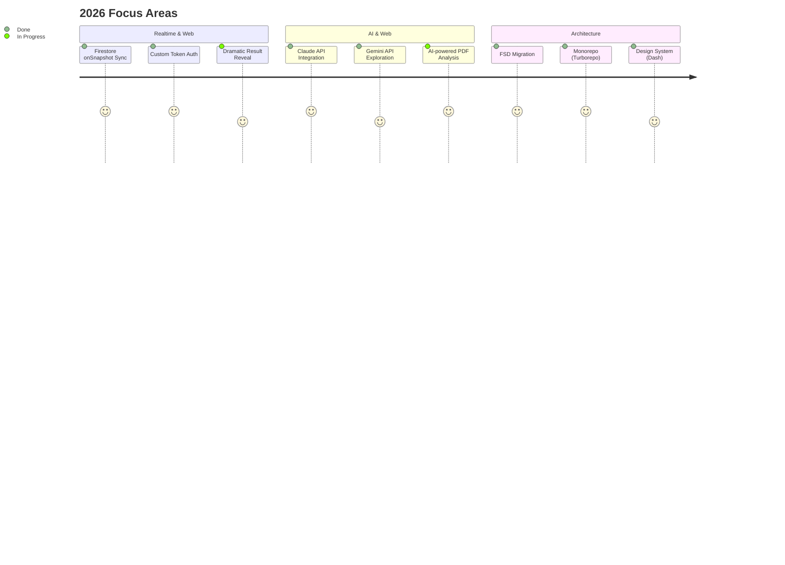

<div align="center">

[](https://github.com/sgd122)

# Gidong Seong

**Web Developer** &nbsp;&middot;&nbsp; Seoul, Korea

I build web products with clean architecture and great developer experience.<br/>
Currently at **[@NCredibleAI](https://github.com/NCredibleAI)**, building AI Agent × OT products for food manufacturing.<br/>
Previously at **[@travelmakers](https://github.com/travelmakers)**, building Next.js platforms and design systems.

<br/>

[`Blog`](https://blog.dnd.ac/) &nbsp;&middot;&nbsp; [`LinkedIn`](https://www.linkedin.com/in/sgd122/) &nbsp;&middot;&nbsp; [`Email`](mailto:sgd0947@gmail.com)

</div>

<br/>

## Currently Working On

- Building [**GDG Busan Hackathon Vote**](https://github.com/gdg-busan/2026-Build-with-AI-Hackaton-in-Busan) — 실시간 투표 플랫폼 (Next.js 16 + React 19 + Cloud Firestore)
- Designing weighted scoring (심사위원 + 참가자 가중 점수) with anti-fraud 4중 검증
- Crafting a "Living Terminal" dark UI with dramatic countdown result reveals


```mermaid
journey
    title 2026 Focus Areas
    section Realtime & Web
      Firestore onSnapshot Sync: 5: Done
      Custom Token Auth: 5: Done
      Dramatic Result Reveal: 4: In Progress
    section AI & Web
      Claude API Integration: 5: Done
      Gemini API Exploration: 4: Done
      AI-powered PDF Analysis: 5: In Progress
    section Architecture
      FSD Migration: 5: Done
      Monorepo (Turborepo): 5: Done
      Design System (Dash): 4: Done
```

<br/>

## Dev Approach

```
Type-safe everything     Zod validation + TypeScript strict mode, end-to-end type safety
FSD architecture         Layered imports: shared → entities → features → widgets → pages
Monorepo-first           Turborepo + pnpm workspaces, shared packages across apps
Production habits        Rate limiting, audit logging, PII filtering, CORS — built in from day one
```

<br/>

## Stack

```
Frontend        TypeScript  ·  React  ·  Next.js  ·  Tailwind CSS  ·  React Native
Backend         Node.js  ·  Supabase  ·  Firebase  ·  GraphQL  ·  MySQL
Infra           Docker  ·  GitHub Actions  ·  AWS  ·  Vercel  ·  Turborepo
```

<br/>

<details>
<summary><b>WakaTime</b></summary>
<br/>

<!--START_SECTION:waka-->


**I'm an Early 🐤** 

```text
🌞 Morning                5326 commits        ██████░░░░░░░░░░░░░░░░░░░   25.32 % 
🌆 Daytime                10842 commits       █████████████░░░░░░░░░░░░   51.55 % 
🌃 Evening                4792 commits        ██████░░░░░░░░░░░░░░░░░░░   22.78 % 
🌙 Night                  73 commits          ░░░░░░░░░░░░░░░░░░░░░░░░░   00.35 % 
```
📅 **I'm Most Productive on Wednesday** 

```text
Monday                   3131 commits        ████░░░░░░░░░░░░░░░░░░░░░   14.89 % 
Tuesday                  3834 commits        █████░░░░░░░░░░░░░░░░░░░░   18.23 % 
Wednesday                5209 commits        ██████░░░░░░░░░░░░░░░░░░░   24.77 % 
Thursday                 2933 commits        ███░░░░░░░░░░░░░░░░░░░░░░   13.94 % 
Friday                   2926 commits        ███░░░░░░░░░░░░░░░░░░░░░░   13.91 % 
Saturday                 1519 commits        ██░░░░░░░░░░░░░░░░░░░░░░░   07.22 % 
Sunday                   1481 commits        ██░░░░░░░░░░░░░░░░░░░░░░░   07.04 % 
```


📊 **This Week I Spent My Time On** 

```text
🕑︎ Time Zone: Asia/Seoul

💬 Programming Languages: 
Other                    1 hr 24 mins        █████████████░░░░░░░░░░░░   52.44 % 
Markdown                 35 mins             ██████░░░░░░░░░░░░░░░░░░░   22.11 % 
Python                   24 mins             ████░░░░░░░░░░░░░░░░░░░░░   14.89 % 
TypeScript               16 mins             ███░░░░░░░░░░░░░░░░░░░░░░   10.02 % 
JSON                     0 secs              ░░░░░░░░░░░░░░░░░░░░░░░░░   00.55 % 

🔥 Editors: 
Google Calendar          1 hr                █████████░░░░░░░░░░░░░░░░   37.02 % 
Hermes                   41 mins             ██████░░░░░░░░░░░░░░░░░░░   25.84 % 
Claude Code              27 mins             ████░░░░░░░░░░░░░░░░░░░░░   17.10 % 
Cursor                   24 mins             ████░░░░░░░░░░░░░░░░░░░░░   15.12 % 
Codex Vscode             7 mins              █░░░░░░░░░░░░░░░░░░░░░░░░   04.92 % 

💻 Operating System: 
Mac                      1 hr 42 mins        ████████████████░░░░░░░░░   62.98 % 
Unknown OS               1 hr                █████████░░░░░░░░░░░░░░░░   37.02 % 
```

🤖 **AI Coding This Week** 

```text
⏱ AI Coding Time: 1 hr 41 mins (62.88%)

✍️ 193 lines written by AI, 0 lines written by hand (100.0% AI-written)

🔤 794,297 Input Tokens, 42,866 Output Tokens

💵 $7.30 Estimated AI Cost This Week

🧠 25 AI Sessions, 38 AI Prompts

Sonnet                   170 lines           ██████████████████████░░░   88.08 % 
Composer                 23 lines            ███░░░░░░░░░░░░░░░░░░░░░░   11.92 % 
GPT                      0 lines             ░░░░░░░░░░░░░░░░░░░░░░░░░   00.00 % 

🔎 AI Coding Insights:
🤖 AI-Driven — 100.0% of written lines came from AI
📚 Verbose Prompter — average 5,470 characters per prompt
🔁 Iterative Prompter — average 2 prompts per session
🚀 High AI Trust — 0.0% of changed lines were hand-edited
```

**I Mostly Code in TypeScript** 

```text
TypeScript               31 repos            ███████████░░░░░░░░░░░░░░   43.66 % 
JavaScript               21 repos            ███████░░░░░░░░░░░░░░░░░░   29.58 % 
Jupyter Notebook         2 repos             █░░░░░░░░░░░░░░░░░░░░░░░░   02.82 % 
Shell                    1 repo              ░░░░░░░░░░░░░░░░░░░░░░░░░   01.41 % 
MDX                      1 repo              ░░░░░░░░░░░░░░░░░░░░░░░░░   01.41 % 
```


 Last Updated on 23/09/2026 03:55:20 UTC
<!--END_SECTION:waka-->

</details>

<br/>

<div align="center">

[](https://github.com/sgd122)

</div>
