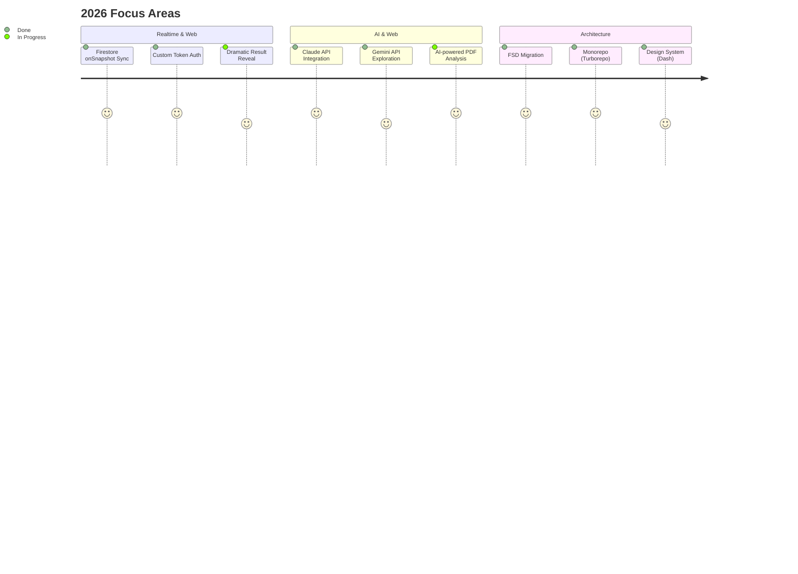

<div align="center">

[](https://github.com/sgd122)

# Gidong Seong

**Web Developer** &nbsp;&middot;&nbsp; Seoul, Korea

I build web products with clean architecture and great developer experience.<br/>
Previously at **[@travelmakers](https://github.com/travelmakers)**, building Next.js platforms and design systems.

<br/>

[`Blog`](https://blog.dnd.ac/) &nbsp;&middot;&nbsp; [`LinkedIn`](https://www.linkedin.com/in/sgd122/) &nbsp;&middot;&nbsp; [`Email`](mailto:sgd0947@gmail.com)

</div>

<br/>

## Currently Working On

- Building [**GDG Busan Hackathon Vote**](https://github.com/gdg-busan/2026-Build-with-AI-Hackaton-in-Busan) — 실시간 투표 플랫폼 (Next.js 16 + React 19 + Cloud Firestore)
- Designing weighted scoring (심사위원 + 참가자 가중 점수) with anti-fraud 4중 검증
- Crafting a "Living Terminal" dark UI with dramatic countdown result reveals


```mermaid
journey
    title 2026 Focus Areas
    section Realtime & Web
      Firestore onSnapshot Sync: 5: Done
      Custom Token Auth: 5: Done
      Dramatic Result Reveal: 4: In Progress
    section AI & Web
      Claude API Integration: 5: Done
      Gemini API Exploration: 4: Done
      AI-powered PDF Analysis: 5: In Progress
    section Architecture
      FSD Migration: 5: Done
      Monorepo (Turborepo): 5: Done
      Design System (Dash): 4: Done
```

<br/>

## Dev Approach

```
Type-safe everything     Zod validation + TypeScript strict mode, end-to-end type safety
FSD architecture         Layered imports: shared → entities → features → widgets → pages
Monorepo-first           Turborepo + pnpm workspaces, shared packages across apps
Production habits        Rate limiting, audit logging, PII filtering, CORS — built in from day one
```

<br/>

## Stack

```
Frontend        TypeScript  ·  React  ·  Next.js  ·  Tailwind CSS  ·  React Native
Backend         Node.js  ·  Supabase  ·  Firebase  ·  GraphQL  ·  MySQL
Infra           Docker  ·  GitHub Actions  ·  AWS  ·  Vercel  ·  Turborepo
```

<br/>

<details>
<summary><b>WakaTime</b></summary>
<br/>

<!--START_SECTION:waka-->


**I'm an Early 🐤** 

```text
🌞 Morning                5239 commits        ██████░░░░░░░░░░░░░░░░░░░   25.28 % 
🌆 Daytime                10634 commits       █████████████░░░░░░░░░░░░   51.31 % 
🌃 Evening                4777 commits        ██████░░░░░░░░░░░░░░░░░░░   23.05 % 
🌙 Night                  73 commits          ░░░░░░░░░░░░░░░░░░░░░░░░░   00.35 % 
```
📅 **I'm Most Productive on Wednesday** 

```text
Monday                   3032 commits        ████░░░░░░░░░░░░░░░░░░░░░   14.63 % 
Tuesday                  3744 commits        █████░░░░░░░░░░░░░░░░░░░░   18.07 % 
Wednesday                5174 commits        ██████░░░░░░░░░░░░░░░░░░░   24.97 % 
Thursday                 2903 commits        ████░░░░░░░░░░░░░░░░░░░░░   14.01 % 
Friday                   2874 commits        ███░░░░░░░░░░░░░░░░░░░░░░   13.87 % 
Saturday                 1515 commits        ██░░░░░░░░░░░░░░░░░░░░░░░   07.31 % 
Sunday                   1481 commits        ██░░░░░░░░░░░░░░░░░░░░░░░   07.15 % 
```


📊 **This Week I Spent My Time On** 

```text
🕑︎ Time Zone: Asia/Seoul

💬 Programming Languages: 
Other                    4 hrs               █████████████████░░░░░░░░   69.27 % 
Markdown                 1 hr 15 mins        █████░░░░░░░░░░░░░░░░░░░░   21.78 % 
TypeScript               20 mins             █░░░░░░░░░░░░░░░░░░░░░░░░   05.83 % 
Bash                     7 mins              █░░░░░░░░░░░░░░░░░░░░░░░░   02.14 % 
JSON                     3 mins              ░░░░░░░░░░░░░░░░░░░░░░░░░   00.99 % 

🔥 Editors: 
Google Calendar          4 hrs               █████████████████░░░░░░░░   69.27 % 
Cursor                   1 hr 34 mins        ███████░░░░░░░░░░░░░░░░░░   27.41 % 
VS Code                  11 mins             █░░░░░░░░░░░░░░░░░░░░░░░░   03.33 % 

💻 Operating System: 
Unknown OS               4 hrs               █████████████████░░░░░░░░   69.27 % 
Mac                      1 hr 46 mins        ████████░░░░░░░░░░░░░░░░░   30.73 % 
```

🤖 **AI Coding This Week** 

```text
No AI Coding Activity Tracked This Week
```

**I Mostly Code in TypeScript** 

```text
TypeScript               30 repos            ███████████░░░░░░░░░░░░░░   42.86 % 
JavaScript               21 repos            ████████░░░░░░░░░░░░░░░░░   30.00 % 
Jupyter Notebook         2 repos             █░░░░░░░░░░░░░░░░░░░░░░░░   02.86 % 
Shell                    1 repo              ░░░░░░░░░░░░░░░░░░░░░░░░░   01.43 % 
MDX                      1 repo              ░░░░░░░░░░░░░░░░░░░░░░░░░   01.43 % 
```


 Last Updated on 01/09/2026 04:10:30 UTC
<!--END_SECTION:waka-->

</details>

<br/>

<div align="center">

[](https://github.com/sgd122)

</div>
